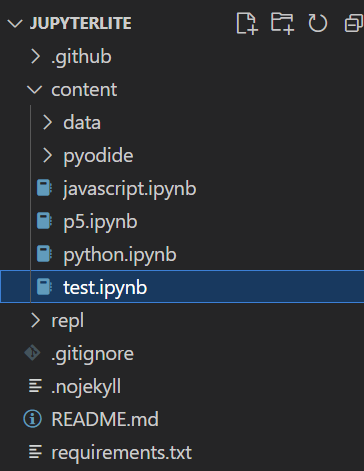

### Step 1: Deploy your JupyterLite website on GitHub pages

We need a place to store the notebooks and a kernel torun Python in the browser -- no server required. JupyterLite uses the Pyodide kernel. Follow the instructions [here](https://jupyterlite.readthedocs.io/en/latest/quickstart/deploy.html) to clone the JupyterLite demo and deploy using GitHub pages.

Step 2: Place custom a notebook file in the `content` folder of the repo. Push changes to update.

Create your notebook file using any editor you wish. They could also be added through the JupyterLite website. If you use an external editor (e.g. vscode) you need to push changes in order to update.



### Step 3: Open the website and expand the notebook. Copy the URL.

<!--  -->

### Step 4: Paste the URL into `iframe` block src (works with .md and .html)

```md
<iframe
  src="https://julianlpowers.github.io/jupyterlite/notebooks/index.html?path=test.ipynb"
  width="100%"
  height="300px"
>
</iframe>
```

### The result:

<iframe
  src="https://julianlpowers.github.io/jupyterlite/notebooks/index.html?path=test.ipynb"
  width="100%"
  height="300px"
>
</iframe>

you can even make edits, add cells, and export the code.
